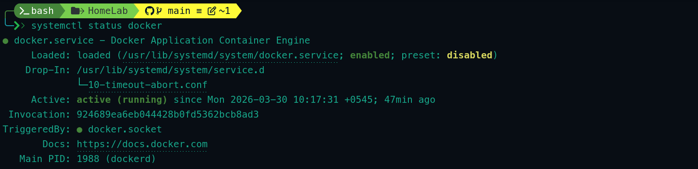
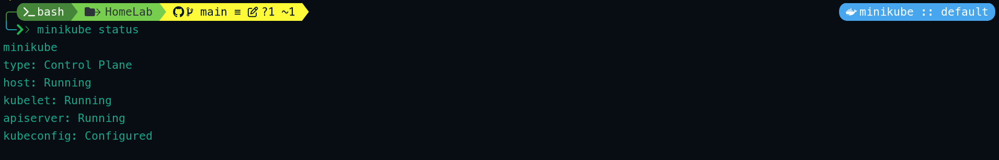

# Cluster Setup

1. [Install Docker](#1-install-docker)
2. [Install Minikube](#2-install-minikube)
3. [Install Kubectl](#3-install-kubectl)
4. [Create Cluster](#4-create-cluster)

## 1. Install Docker

Installing in fedora workstation 43

```bash
# update system
sudo dnf update 

# install docker
sudo dnf install docker

# enable and start docker 
sudo systemctl enable --now docker

# add user to docker group
sudo usermod -aG docker $USER
newgrp docker

# check status
systemctl status docker
```


---

## 2. Install Minikube 
[Visit: minikube.sigs.k8s.io/docs](https://minikube.sigs.k8s.io/docs/start/?arch=%2Flinux%2Fx86-64%2Fstable%2Fbinary+download)
```bash
# install minikube
curl -LO https://github.com/kubernetes/minikube/releases/latest/download/minikube-linux-amd64
sudo install minikube-linux-amd64 /usr/local/bin/minikube && rm minikube-linux-amd64

# check version
minikube version
```
---

## 3. Install Kubectl

```bash
# install kubectl
sudo dnf install kubectl

# check version
kubectl version
```

---


## 4. Create Cluster
```bash
# create cluster
minikube start --cpus=4 --memory=8192 --driver=docker

# check status
minikube status

# list addons
minikube addons list

# enable addons ingress
minikube addons enable ingress
```
minikube status


---