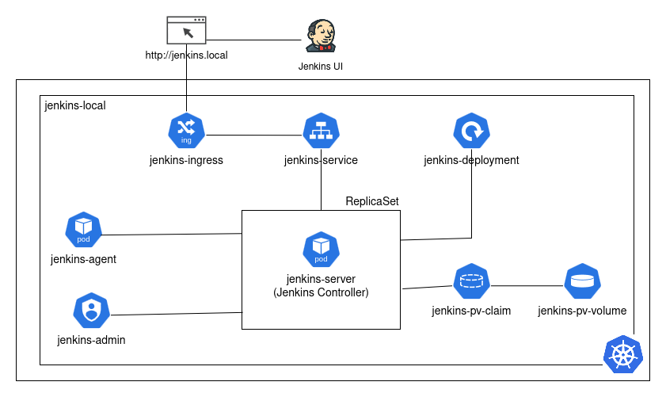

# Jenkins In Kubernetes
A Kubernetes deployment for Jenkins, including controller, agent pods, persistent storage, and ingress setup.

---

## **Table of Contents**

1. [Architecture](#architecture)
2. [Prerequisites](#prerequisites)
3. [Installation Guides](#installation-guides)
4. [Usage](#usage)
5. [Directory Structure](#directory-structure)
6. [Customizations](#customizations)
7. [Troubleshooting](#troubleshooting)
8. [References](#references)

---

## **Architecture**



Jenkins runs fully in jenkins-local namespace, with persistent storage, dynamic agents, secure RBAC access, and external access via ingress.

* **Namespace:** `jenkins-local` – isolated environment for Jenkins.
* **Storage:** `home-lab-storage` StorageClass → `jenkins-pv-volume` (PersistentVolume) bound to `jenkins-pv-claim` (PersistentVolumeClaim) for Jenkins data.
* **Deployment & Pods:** `jenkins-deployment` manages `jenkins-server` (controller/master) and dynamic `jenkins-agent` pods for build jobs.
* **Access & Networking:** `jenkins-service` provides internal access; `jenkins-ingress` exposes Jenkins externally at `http://jenkins.local`.
* **Permissions:** `jenkins` ServiceAccount with Role & RoleBinding grants admin-level cluster permissions.

---

## **Prerequisites**

* Kubernetes cluster (Minikube)
* `kubectl` installed
* Docker 
* CPU: 4 
* Memory: 8192

---

## **Installation Guides**

1. **[Setup Jenkins](./jenkinsSetup.md)**
2. **[Jenkins Manifest](./manifest/)**
3. **[Fix Broken Reverse Proxy](./fixReverseProxy.md)**
4. **[Setup Kubernetes Cloud](./cloudsSetup.md)**

---
## **Usage**

* Access Jenkins UI via browser: `http://jenkins.local`
* Create jobs, pipelines, or configure agents
* Example: Run a sample pipeline

```groovy
pipeline {
    agent any
    stages {
        stage('Print Env') {
            steps {
                sh 'echo $JAVA_HOME'
            }
        }
    }
}
```

---

## **Directory Structure**

```
jenkins/
├── manifest
│   ├── agent-podTemplate.yaml
│   ├── jenkins-deployment.yaml
│   ├── jenkins-ingress.yaml
│   ├── jenkins-serviceAccount.yaml
│   ├── jenkins-service.yaml
│   └── jenkins-volume.yaml
└── README.md

```

---

## **Customizations**

* Change Jenkins image version
* Add more agents
* Modify ingress host or path
* Use Helm for easier upgrades

---

## **Troubleshooting**

* `PodPending`: Check storage and node resources
* `Ingress not reachable`: Check DNS and Minikube ingress addon
* `Jenkins agent not connecting`: Verify ServiceAccount and labels

---

## **References**

* [Jenkins Kubernetes Plugin](https://plugins.jenkins.io/kubernetes/)
* [Kubernetes Docs](https://kubernetes.io/docs/)
* [Minikube Docs](https://minikube.sigs.k8s.io/docs/)

---
