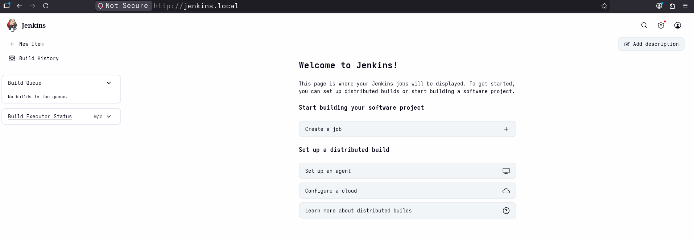

# Jenkins Setup

### 1. Create Namespace
```bash
# create namespace
kubectl create namespace jenkins-local

# set default namespace
kubectl config set-context --current --namespace=jenkins-local
```
---

### 2. Create Service Account

 - jenkins-serviceAccount.yaml

```yaml
---
apiVersion: rbac.authorization.k8s.io/v1
kind: Role
metadata:
  name: jenkins-admin
  namespace: jenkins-local
  labels:
    env: home-lab
  annotations:
    description: "role for jenkins controller"
rules:
  - apiGroups: [""]
    resources: ["pods"]
    verbs: ["create", "delete", "get", "list", "watch"]
  - apiGroups: [""]
    resources: ["pods/log"]
    verbs: ["get"]
  - apiGroups: [""]
    resources: ["pods/exec"]
    verbs: ["create"]
  - apiGroups: [""]
    resources: ["secrets"]
    verbs: ["list", "get"]
  - apiGroups: [""]
    resources: ["configmaps"]
    verbs: ["get", "list"]
---
apiVersion: v1
kind: ServiceAccount
metadata:
  name: jenkins-admin
  namespace: jenkins-local
  labels:
    env: home-lab
  annotations:
    description: "service account for jenkins controller"
---
apiVersion: rbac.authorization.k8s.io/v1
kind: RoleBinding
metadata:
  name: jenkins-admin
  namespace: jenkins-local
  labels:
    env: home-lab 
  annotations:
    description: "rolebinding for jenkins-admin role and jenkins-admin sa" 
roleRef:
  apiGroup: rbac.authorization.k8s.io
  kind: Role
  name: jenkins-admin
subjects:
  - kind: ServiceAccount
    name: jenkins-admin
    namespace: jenkins-local
```

 - Apply

```bash
#----validate----

# client-side: YAML structure and basic scmena
kubectl apply -f jenkins-serviceAccount.yaml --dry-run=client
# server-side: against actual cluster API, Use if cluster is available
kubectl apply -f jenkins-serviceAccount.yaml --dry-run=server 

#----apply----
kubectl apply -f jenkins-serviceAccount.yaml
```

- Useful Commands

```bash
#---service aaount----
kubectl explain sa
kubectl get sa
kubectl describe sa jenkins-admin
kubectl edit sa jenkins-admin
kubeclt delete sa jenkins-admin

#---role---
kubectl explain roles
kubectl get roles
kubectl describe roles jenkins-admin
kubectl edit roles jenkins-admin
kubectl delete roles jenkis-admin

#---rolebinding---
kubectl explain roelbinding
kubectl get rolebinding
kubectl describe rolebinding jenkins-admin

```

---

### 3. Create Local Persistent Volume

- jenkins-volume.yaml
```yaml
kind: StorageClass
apiVersion: storage.k8s.io/v1
metadata:
  name: home-lab-storage
  annotations:
    description: "Local atorage for home-lab"
provisioner: kubernetes.io/no-provisioner
volumeBindingMode: WaitForFirstConsumer
reclaimPolicy: Delete 
allowVolumeExpansion: false 
mountOptions:
  - rw 
---
apiVersion: v1
kind: PersistentVolume
metadata:
  name: jenkins-pv-volume
  labels:
    type: local-storage
  annotations:
    description: "pv for jenkins home-lab"
  finalizers:
    - kubernetes.io/pv-protection
spec:
  storageClassName: home-lab-storage
  claimRef:
    name: jenkins-pv-claim
    namespace: jenkins-local
  capacity:
    storage: 10Gi
  accessModes:
    - ReadWriteOnce
  local:
    path: /mnt/jenkins
  volumeMode: Filesystem
  persistentVolumeReclaimPolicy: Delete
  mountOptions:
    - rw
  nodeAffinity:
    required:
      nodeSelectorTerms:
      - matchExpressions:
        - key: kubernetes.io/hostname
          operator: In
          values:
          - minikube
---
apiVersion: v1
kind: PersistentVolumeClaim
metadata:
  name: jenkins-pv-claim
  namespace: jenkins-local
  labels:
    type: local-storage
  annotations:
    description: "pvc for jenkins home-lab"
  finalizers:
    - kubernetes.io/pvc-protection
spec:
  storageClassName: home-lab-storage
  volumeMode: Filesystem
  accessModes:
    - ReadWriteOnce
  resources:
    requests:
      storage: 3Gi
```

- Apply

```bash
#---validate---
kubectl apply -f jenkins-volume.yaml --dry-run=client

#---apply---
kubectl apply -f jenkins-volume.yaml
```

- Useful Commands

```bash
#---storage class---
kubectl get sc
kubectl describe sc home-lab-storage

#---pv---
kubectl get pv
kubectl describe pv jenkins-pv-volume

#---pvc---
kubectl get pvc
kubectl describe pv jenkins-pv-claim
```

---

### 4. Create /mnt/jenkins 

```bash
# ssh to minikube
minikube ssh

# create directory
suod mkdir -p /mnt/jenkins

# exit
```

---

### 5. Create Deployment

- jenkins-deployment.yaml

```yaml
apiVersion: apps/v1
kind: Deployment
metadata:
  name: jenkins-deployment
  namespace: jenkins-local
  labels:
    env: home-lab
  annotations:
    description: "deployment for jenkins server"
spec:
  replicas: 1
  selector:
    matchLabels:
      app: jenkins-server
  strategy:
    type: Recreate
  template:
    metadata:
      labels:
        app: jenkins-server
    spec:
      securityContext:
            fsGroup: 1000
            runAsUser: 1000
      serviceAccountName: jenkins-admin
      containers:
        - name: jenkins
          image: jenkins/jenkins:lts
          imagePullPolicy: Always
          resources:
            limits:
              memory: "2Gi"
              cpu: "1000m"
            requests:
              memory: "500Mi"
              cpu: "500m"
          ports:
            - name: httpport
              containerPort: 8080
            - name: jnlpport
              containerPort: 50000
          livenessProbe:
            httpGet:
              path: "/login"
              port: 8080
            initialDelaySeconds: 90
            periodSeconds: 10
            timeoutSeconds: 5
            failureThreshold: 5
          readinessProbe:
            httpGet:
              path: "/login"
              port: 8080
            initialDelaySeconds: 60
            periodSeconds: 10
            timeoutSeconds: 5
            failureThreshold: 3
          volumeMounts:
            - name: jenkins-data
              mountPath: /var/jenkins_home
      volumes:
        - name: jenkins-data
          persistentVolumeClaim:
              claimName: jenkins-pv-claim
```

- Apply

```bash
#----validate----
kubectl apply -f jenkins-deployment.yaml --dry-run=client

#----apply----
kubectl apply -f jenkins-deployment.yaml
```

- Useful Commands

```bash
#----deployments----
kubectl get deployments
kubectl describe deployments jenkins-deployment

#----pods----
kubectl get pods
kubectl describe pods <pod_name>
kubectl logs <pod_name>
kubectl get pod -o wide
kubectl logs -f <pod_name>
kubectl exec -it <pod-name> -- /bin/sh 
kubectl top pod
```
---


### 6. Create Service

- jenkins-service.yaml 

```yaml
apiVersion: v1
kind: Service
metadata:
  name: jenkins-service
  namespace: jenkins-local
  labels:
    env: home-lab
  annotations:
      prometheus.io/scrape: 'true'
      prometheus.io/path:   /
      prometheus.io/port:   '8080'
spec:
  selector:
    app: jenkins-server
  type: ClusterIP
  ports:
    - port: 8080
      targetPort: 8080
```

- Apply

```bash
#----validate----
kubectl apply -f jenkins-service.yaml --dry-run=client

#---apply---
kubectl apply -f jenkins-service.yaml
```

- Useful Commands

```bash
kubectl get svc
kubectl describe svc jenkins-service
```
---

### 7. Edit /etc/hosts

```bash
# get minikube ip
minikube ip

# add to /etc/hosts
sudo echo "<minikube-ip> jenkins.local" >> /etc/hosts
```

---

### 8. Create Ingress 

- jenkins-ingress.yaml

```yaml
apiVersion: networking.k8s.io/v1
kind: Ingress
metadata:
  name: jenkins-ingress
  namespace: jenkins-local
  labels:
    env: home-lab
  annotations:
    nginx.ingress.kubernetes.io/rewrite-target: /
spec:
  rules:
  - host: jenkins.local
    http:
      paths:
      - path: /
        pathType: Prefix
        backend:
          service:
            name: jenkins-service
            port:
              number: 8080
```

- Apply

```bash
#----validate----
kubectl apply -f jenkins-ingress.yaml --dry-run=client

#----apply----
kubectl apply -f jenkins-ingress.yaml
```

- Useful Commands

```bash
kubectl get ingress
kubectl describe ingress jenkins-ingress
```

---


### 9. Setup Jenkins Admin

- Visit: http://jenkins.local

```bash
# initial password is available at the end of the log
kubectl logs <pod_name> 

```

- Install plugins
- Create User

---

### 10. Jenkins Ui



---