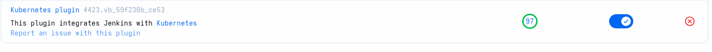
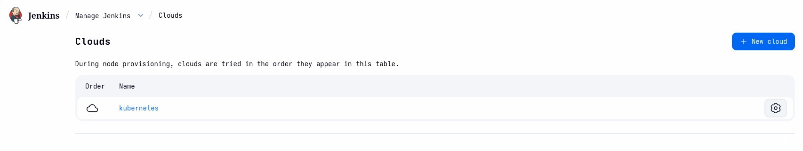
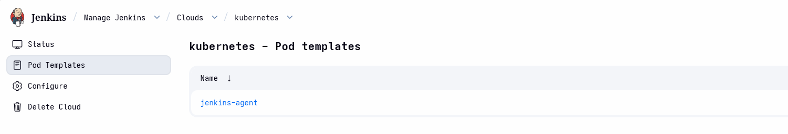
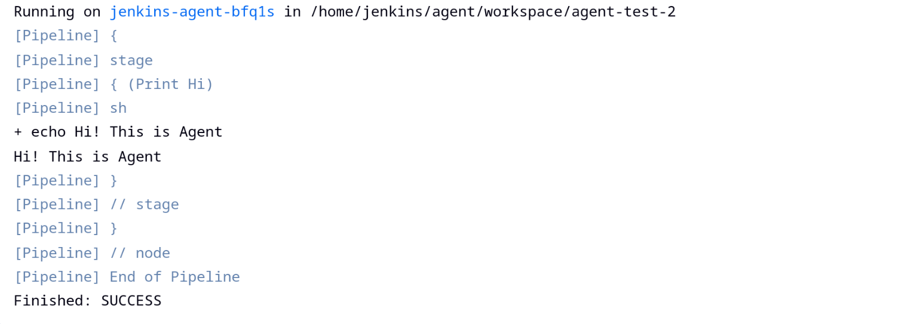
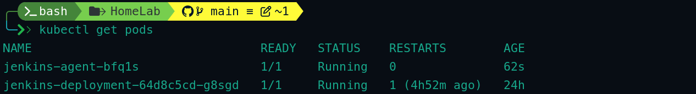

# Clouds Setup

In Jenkins, "Clouds" refer to external systems or platforms that Jenkins can connect to in order to dynamically create and manage build agents (also called nodes or executors) on demand.

## Kubernetes cloud

Kubernetes Cloud in Jenkins is a powerful feature provided by the Kubernetes plugin that allows Jenkins to dynamically create and manage build agents as temporary Kubernetes Pods.

## Kubernetes Cloud Setup

### Step 1: Install the Kubernetes Plugin

1. Log in to Jenkins at **http://jenkins.local**
2. Go to **Manage Jenkins** → **Plugins** → **Available tab**
3. Search for "**Kubernetes**"
4. Check the box and click **Install without restart** (or install and restart)
5. Wait for installation to complete



---

### Step 2: Configure Kubernetes Cloud

1. Go to **Manage Jenkins** → **Manage Nodes and Clouds** → **Configure Clouds**
2. Click **Add a new cloud** → Select **Kubernetes**
3. Fill in the following details:

   - **Name**: kubernetes 
   - **Kubernetes URL**: Leave **blank** (auto-detects in-cluster)
   - **Kubernetes Namespace**: jenkins-local
   - **WebSocket**: checked
   - **Enable Garbage Collection**: checked

4. Save it



---

### Step 3: Add Pod Templates 

Pod Templates define what your agent pods will look like.

1. Under the Kubernetes cloud, click **Add Pod Template**
2. Configure basic settings:

   - **Name**: jenkins-agent
   - **Labels**: jenkins-agent
   - **Usage**: Use this node as much as possible
   - **Containers** → Add container:
     - Name: jnlp
     - Image: jenkins/inbound-agent:latest
     - Always pull image: checked (optional)
   - **Volumes** (optional): Add hostPath or emptyDir if needed
   - **Resource limits** (recommended):
     - CPU: 1
     - Memory: 2Gi
3. Save It



---

### Step 4: Use in Pipeline (Jenkinsfile Example)

```groovy
pipeline {
    agent {
        label 'jenkins-agent'  // Use the pod template you created
    }
    stages {
        stage('Print Hi') {
            steps {
                sh 'echo "Hi! This is Agent."'
            }
        }
    }
}
```
- Pipeline Output


- Dynamic Agent Pod



---


