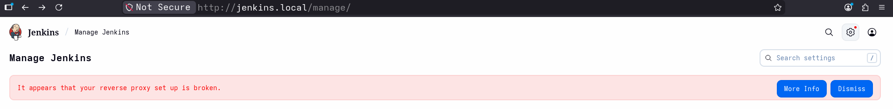
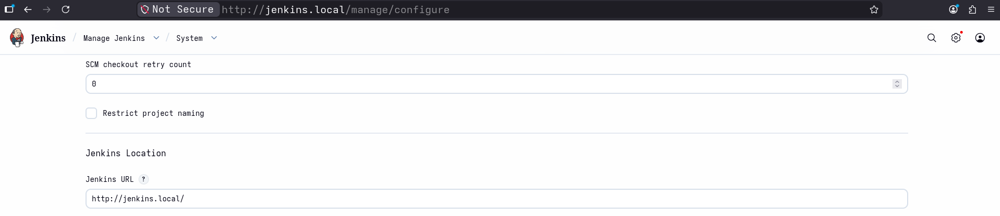

# Fix Broken Reverse Proxy

## Problem

`browser`---> `http://jenkins.local` ---> `jenkins-ingress` ---> `http://<cluster-ip>:8080`

---

- Internally Jenkins Runs at: `http://<cluster-ip>:8080`
- Externally Jenkins Accessed at: `http://jenkins.local`

Jenkins assumes the host is `http://<cluster-ip>:8080` and generates URLs and headers based on that. It is unaware of `http://jenkins.local` and therefore cannot generate correct external URLs, causing `broken links, failed redirects, and the “reverse proxy setup is broken”` warning in the browser.

---

## Solution

---